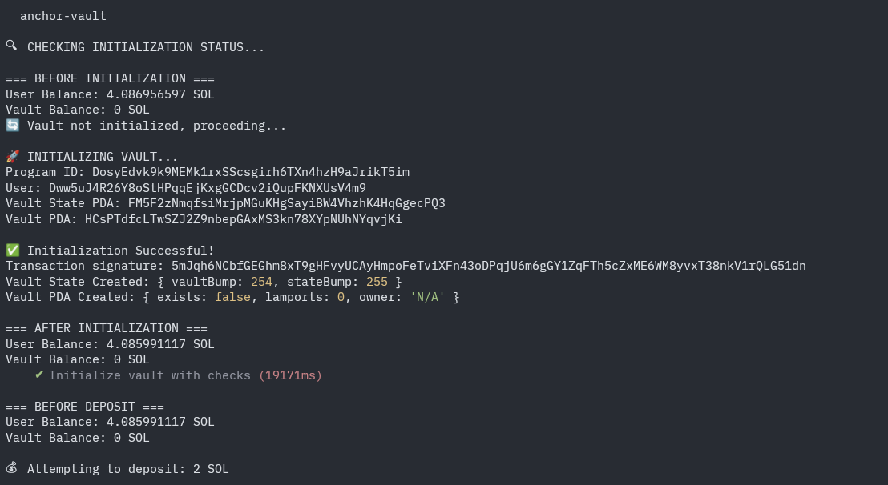
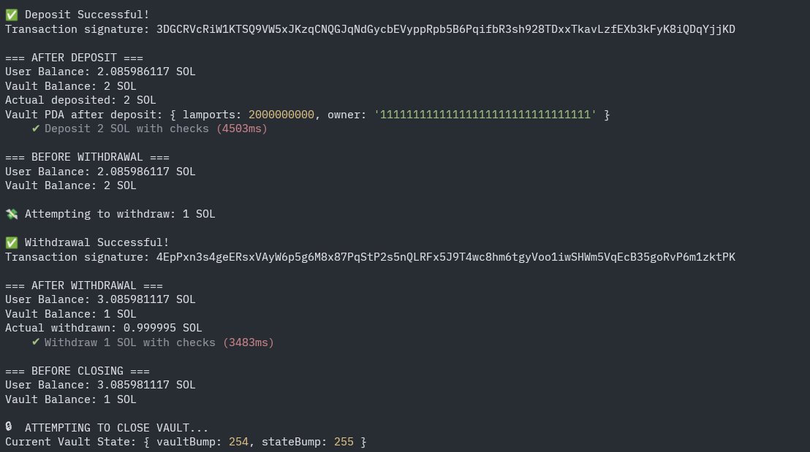
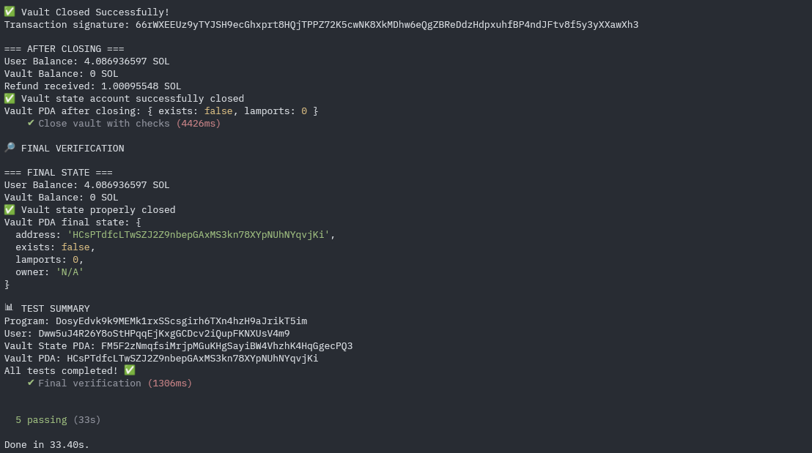

# Anchor_Vault

(deployed contract on devnet) - [tx](https://explorer.solana.com/tx/4yNo3uDQCTpB92ZnkoC9USMxDkKR2RSk9VAnZgwncpSQBBdYi69xA8cswKyU7S92WCrwdHds5qGU5hTh3mWpxemt?cluster=devnet)

## 🔁 Devnet Transactions

| # | Instruction | Tx Signature (Explorer Link) |
|---|-------------|----------------------------|
| 1 | Initialize | https://explorer.solana.com/tx/5mJqh6NCbfGEGhm8xT9gHFvyUCAyHmpoFeTviXFn43oDPqjU6m6gGY1ZqFTh5cZxME6WM8yvxT38nkV1rQLG51dn?cluster=devnet |
| 2 | Deposit | https://explorer.solana.com/tx/3DGCRVcRiW1KTSQ9VW5xJKzqCNQGJqNdGycbEVyppRpb5B6PqifbR3sh928TDxxTkavLzfEXb3kFyK8iQDqYjjKD?cluster=devnet |
| 3 | Withdraw | https://explorer.solana.com/tx/4EpPxn3s4geERsxVAyW6p5g6M8x87PqStP2s5nQLRFx5J9T4wc8hm6tgyVoo1iwSHWm5VqEcB35goRvP6m1zktPK?cluster=devnet |
| 4 | Close | https://explorer.solana.com/tx/66rWXEEUz9yTYJSH9ecGhxprt8HQjTPPZ72K5cwNK8XkMDhw6eQgZBReDdzHdpxuhfBP4ndJFtv8f5y3yXXawXh3?cluster=devnet |

## Transaction Screenshots

### 1. Initialize Transaction -

### 2. Deposit and Withdraw Transaction  

### 3. Close Transaction

